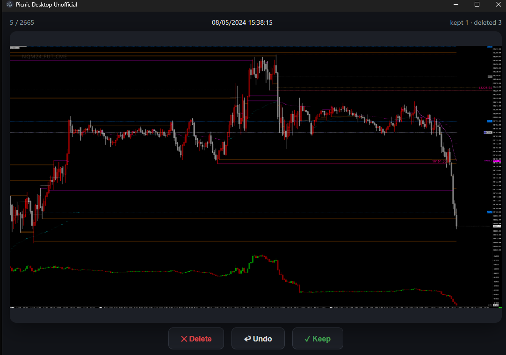

# Picnic Desktop (Unofficial)

Unofficial desktop app inspired by the [Picnic iOS app](https://www.picnic.photos/) — sort your photo library one picture at a time, Tinder-style.

Not affiliated with or endorsed by the makers of Picnic.



## What it does

1. Pick a folder.
2. Every image and video in it (and its subfolders) is scanned and sorted by capture date (EXIF for photos, file date otherwise).
3. One item at a time (videos autoplay muted):
   - **Swipe left / press ←** — delete (goes to the Recycle Bin / Trash, never permanently deleted)
   - **Swipe right / press →** — keep
   - **Z / Backspace** — undo the last action
4. Kept photos are remembered on disk, so the next scan only shows you photos you haven't decided on yet.

Arrow keys act instantly with no animation lag, and upcoming images are preloaded — hammer through thousands of photos fast.

## Tech

Electron + React + TypeScript, built with [electron-vite](https://electron-vite.org/). EXIF parsing via [exifr](https://github.com/MikeKovarik/exifr).

## Development

```bash
npm install
npm run dev        # launch with hot reload
npm run typecheck  # strict TS check
npm run dist:win   # build Windows installer
npm run dist:mac   # build macOS dmg (requires a Mac)
```

Kept-photo state lives in `kept.json` under the app's user-data directory (`%APPDATA%/picnic-desktop-unofficial` on Windows, `~/Library/Application Support/picnic-desktop-unofficial` on macOS).

## License

[PolyForm Noncommercial 1.0.0](./LICENSE.md) — free for personal and noncommercial use; commercial use is not permitted.
